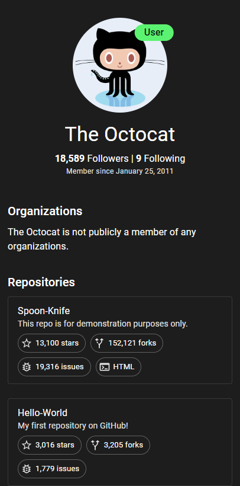

# GitHub Profile Finder

An interactive React application for searching and displaying GitHub user profiles, repositories, and organizations via the GitHub REST API.

🔗 **[Live Demo](https://vojtechsanda.github.io/github-profile-finder/)**

## 📑 Table of Contents

- [🖼️ Screenshots](#-screenshots)
- [🚀 Features](#-features)
- [🛠️ Tech Stack](#-tech-stack)
- [🎯 Usage](#-usage)
  - [Getting started](#getting-started)
  - [Sample Users](#sample-users)
- [📦 Installation](#-installation)
  - [Prerequisites](#prerequisites)
  - [Installation](#installation)
- [🚀 Development](#-development)
  - [Available Scripts](#available-scripts)
  - [Project Structure](#project-structure)
  - [Key Components](#key-components)
  - [API Integration](#api-integration)

## 🖼️ Screenshots

Here’s a quick look at GitHub Profile Finder’s mobile interface:

| Search Page                              | Profile Page                               |
| ---------------------------------------- | ------------------------------------------ |
|  |  |

👉 Try it yourself in the **[Live Demo](https://vojtechsanda.github.io/github-profile-finder/)**!

## 🚀 Features

| Feature               | Description                                        |
| --------------------- | -------------------------------------------------- |
| **User Search**       | Find GitHub users by their username                |
| **Profile View**      | See avatar, bio, followers, and join date          |
| **Repositories**      | View public repos with stars, forks, and languages |
| **Organizations**     | Explore organizations the user belongs to          |
| **Responsive Design** | Optimized for mobile and desktop                   |
| **Fast Loading**      | Parallel API requests with loading indicators      |
| **Modern UI**         | Built with Material UI and custom theme            |
| **Smooth Animations** | Framer Motion for nice transitions                 |

## 🛠️ Tech Stack

| Category         | Tools & Libraries        |
| ---------------- | ------------------------ |
| **Framework**    | React 18 with TypeScript |
| **UI Library**   | Material UI (MUI)        |
| **Routing**      | React Router             |
| **Forms**        | React Hook Form          |
| **Animation**    | Framer Motion            |
| **HTTP Client**  | Axios                    |
| **Build Tool**   | Vite                     |
| **Code Quality** | ESLint + Prettier        |

## 🎯 Usage

### Getting started

Search by GitHub account username and enjoy the profile overview

### Sample Users

| Username   | Description                     |
| ---------- | ------------------------------- |
| `kiwi`     | User with repositories and orgs |
| `octocat`  | GitHub mascot                   |
| `torvalds` | Creator of Linux and Git        |
| `gaearon`  | React core team member          |

## 📦 Installation

### Prerequisites

- Node.js 18+
- npm or yarn

### Installation

1. Clone the repository:

```bash
git clone https://github.com/vojtechsanda/github-profile-finder.git
cd github-profile-finder
```

2. Install dependencies

```
npm install
```

3. Start the development server:

```
npm run dev
```

## 🚀 Development

### Available Scripts

| Script               | Description                  |
| -------------------- | ---------------------------- |
| `npm run dev`        | Start development server     |
| `npm run build`      | Build for production         |
| `npm run preview`    | Preview the production build |
| `npm run lint`       | Run ESLint                   |
| `npm run type-check` | Run TypeScript type checking |

### Project Structure

```
src/
├── components/   # Reusable UI components
│ ├── account/    # Profile-related components
├── loaders/      # Data loading logic (React Router)
├── pages/        # Application pages
├── routes/       # Routing configuration
├── styles/       # Theming and global styles
├── types/        # TypeScript definitions
└── utils/        # Helper functions
```

### Key Components

- **SearchHeader** – Search form with validation
- **AccountDetail** – Main component displaying the user profile
- **AccountHeader** – Header with user information
- **AccountRepositories** – List of repositories with filters
- **AccountOrganizations** – List of user organizations
- **GitHubApi** – Wrapper class for communication with the GitHub API

### API Integration

Uses GitHub REST API:

- `GET /users/{username}` – Fetch user details
- `GET /users/{username}/repos` – List of user repositories
- `GET /users/{username}/orgs` – List of user organizations
- `GET /orgs/{org}` – Organization detail

---

📌 _This project was created as part of a technical interview for a React/TypeScript developer position at [InQool](https://www.inqool.cz/)._
